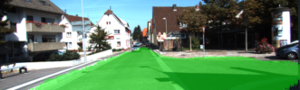
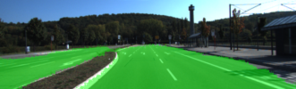
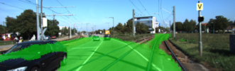

## Semantic Segmentation (Self-Driving Car Engineer Nanodegree)
In this project, the fully-convolutional neural network (FCN) was trained to perform semantic segmentation tasks.
The [Kitti Road](http://www.cvlibs.net/datasets/kitti/eval_road.php) dataset was used for training. 
The output of the FCN has mean IoU (Intersection-over-Union) of 0.827, and 
the FCN shows fine results on both the test images from Kitti Road dataset as well
as on videos from the Internet capturing road during similar season of the year. The FCN does not handle shadows
on the images very well, because, as of now, image augmentation has not been performed during training.

#### Demo

###### Video from the Internet


###### Kitti Road Test Images (Fine)

   



###### Kitti Road Test Images (Poor)

   


#### Setup
(!) You need a GPU to run the code from this repository.
##### Anaconda Environment
To install conda environment with all the dependencies for running the code run:
```bash
$ conda env create -f environment.yml
```
To enter the environment run:
```bash
$ source activate carnd-semantic-segmentation
```

#### Run
To start training:
```
usage: main.py train [-h] [--epochs EPOCHS]
                     [--save_model_freq SAVE_MODEL_FREQ]
                     [--batch_size BATCH_SIZE] [--learning_rate LEARNING_RATE]
                     [--keep_prob KEEP_PROB]
                     [--dataset {kitti_road,cityscapes}]

optional arguments:
  -h, --help            show this help message and exit
  --epochs EPOCHS       number of epochs for training (default: 200)
  --save_model_freq SAVE_MODEL_FREQ
                        frequency of saving model during training (default:
                        10)
  --batch_size BATCH_SIZE
                        number of images to feed to the network simultaneously
                        (default: 14)
  --learning_rate LEARNING_RATE
                        learning rate to be used during training (default:
                        5e-06)
  --keep_prob KEEP_PROB
                        probability of keeping the connection between network
                        nodes for dropout layers (default: 0.5)
  --dataset {kitti_road,cityscapes}
                        dataset to be used for training (default: kitti_road)
```

To start inference:
```
usage: main.py infer [-h] --source_type {video,image,image_directory} --source
                     SOURCE --model MODEL [--dataset {kitti_road,cityscapes}]

optional arguments:
  -h, --help            show this help message and exit
  --source_type {video,image,image_directory}
                        type of input to apply inference on
  --source SOURCE       path to input to apply inference on
  --model MODEL         path to model to use for inference
  --dataset {kitti_road,cityscapes}
                        dataset to be used to retrieve some parameters
                        (default: kitti_road)
```

#### Trained Model Description
The pre-trained FNC can be downloaded via the following link:
[https://yadi.sk/d/Nsgcxp-rkVy7GQ](https://yadi.sk/d/Nsgcxp-rkVy7GQ). It was trained with the following parameters:  

| Parameter or Metric                                 | Value                |
|-----------------------------------------------------|----------------------|
| Number of Epochs                                    | 200                  |  
| Batch Size                                          | 14                   |  
| Learning Rate                                       | 0.000005             |  
| Keep Probability for Dropout Layers during Training | 0.5                  |  
| Loss for Training Data                              | 0.039826041145514454 |  
| Mean IoU Metrics for Training Data                  | 0.8271764607578      |  

The FNC was trained on a machine having GPU: NVIDIA GeForce GTX 1060 Max-Q 6GiB; CPU: Intel Core i7-8750H; RAM: 16 GiB.
When choosing larger batch size, the training fails because of OOM error.

To run the `python main.py infer ...` command, one first needs to either train the FNC himself 
or download the pre-trained.
